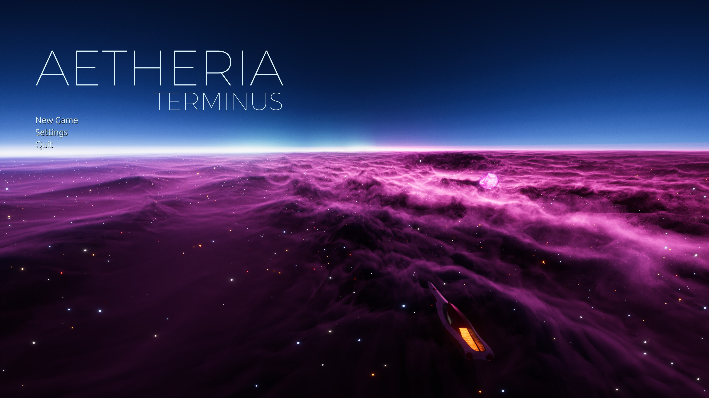

# A Different Sort of Space

<figure class="aetheria-media-card">
  
</figure>

<figure class="aetheria-media-card is-wide">
  
  
A prototype-era Grid horizon. The interface is historical, but the visual thesis survived: space as a navigable pressure field, not a black backdrop politely holding still.

</figure>

Aetheria does not chase hard realism. It treats space as a place of awe, menace, and expressive scale, where gravity can become architecture and the void can feel almost inviting.

That choice is deliberate. The setting wants wonder first: a galaxy dreamlike enough to be memorable and physical enough to feel dangerous. The point is not to abandon consequence, but to make the environment feel strange in ways the politics and technologies can still meaningfully inhabit.

## Design Use

Space is not only a backdrop. It is the board, the weather, the road network, the hiding place, the market boundary, and the source of most bad ideas. Aetheria can stylize space heavily as long as the stylization produces readable play: dangerous zones, navigation choices, sensor language, thermal exposure, faction territory, route value, and environmental identity.

The legacy implementation already points toward this with galaxy generation, map layers, zone rendering, gravity objects, suns, gas giants, volumetric clouds, wormholes, and custom visual effects. The art direction should keep leaning into the surviving principle: beautiful enough to remember, structured enough to use, hostile enough to respect.

The old GDD's environment list is still useful as design vocabulary: stars, protostars, water masses, black holes, dark energy, dark stars, planets, battle aftermaths, asteroid fields, electrical storms, plasma, wormholes, hostile swarms, clouds, and stardust. The current canon can rename and refine them, but the gameplay instinct is sound: the environment should do things.

## Playable Principles

- A route should look and feel different when it is safe, surveilled, abandoned, contested, or strange.
- Environmental spectacle should teach the player something about local risk.
- Stylized physics should remain consistent enough for planning and tactics.
- The void should invite exploration without pretending exploration is harmless.
