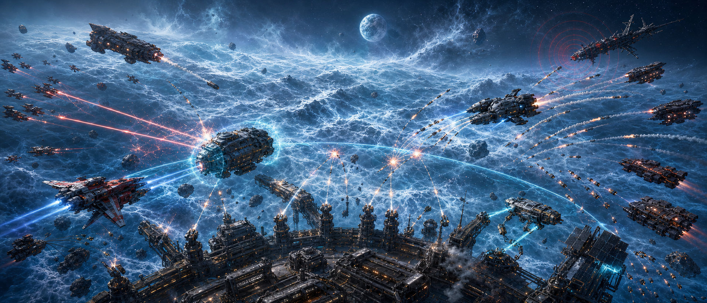

# Aetheria: Starbridge

Game Design Document

Date: 2026-06-24

<figure class="aetheria-media-card is-wide">
  
  
Starbridge as a co-op siege line: the station rim below the camera, defenders holding the perimeter, and pirate pressure advancing across Aetheria's luminous gravitational terrain.

</figure>

## High Concept

**Aetheria: Starbridge** is a 2-5 player cooperative defense game about a small
frontier base surviving escalating waves of attack through asymmetric teamwork.

One player commands the base from an RTS interface: routing power, expanding
infrastructure, fabricating weapons, assigning drones, deploying turrets, and
reading the whole battlefield as a strategic map. The other players fly
individual ships in the Unity client, fighting attackers directly, recovering
salvage, anchoring field structures, and making the urgent close-range saves the
commander cannot make from the chair.

The result is a simple game with a clean silhouette:

> One base. One crew. One player sees the whole war. The others are in it.

## Market Pitch

Starbridge is built for friend groups, not isolated individual fantasies. Its
central market promise is that the group already contains different kinds of
players, and the game finally makes that social shape useful.

The pitch:

> The co-op space defense game for the friend who wants to build the base and
> the friends who want to fly out and save it.

The RTS role is not a burden assigned to a random public-match stranger. It is a
place for the friend who already likes strategy, logistics, tower defense,
factory planning, or commander play. The pilot roles are for the friends who
want movement, combat, salvage, repair, cooling, and clutch field execution.

This makes the design unusual without making it illegible:

- one player commands the base;
- the others fly ships;
- everyone defends the same position;
- waves end in boss technology recovery;
- the team refits, upgrades, and unlocks the next scenario together.

The audience is the co-op group chat: three to five people looking for a game
where different tastes can become a crew instead of a compromise. Starbridge
should market itself less as an RTS/FPS hybrid for genre purists and more as an
asymmetric co-op defense game for mixed-skill, mixed-preference friend groups.

## Design Intent

Aetheria has long wanted two different kinds of players to struggle together in
the same universe: the player who loves systems, economy, construction, and
command, and the player who wants thrust, weapons, heat, dodging, and risk. See
[[Playable Layers]] for the larger design problem Starbridge is cutting into.
**Starbridge** turns that ambition into a readable first release.

The game should be easy to understand in five minutes:

- The base must survive.
- The RTS player builds and directs.
- The pilots fight and recover resources.
- The wave gets worse.
- Communication wins.

The innovation comes from the way those roles depend on one another. The RTS
player is not a spectator, and the pilots are not units. Each side owns
information, agency, and failure modes the others cannot replace.

## Relationship To Aetheria Systems

Starbridge is the short-session co-op proof of Aetheria's larger design stack.
It should not invent a separate class game, economy, or combat model for the
sake of convenience. It should compress existing Aetheria pressures into a
smaller arena where their relationships become easier to read.

Starbridge is a mode inside the broader [[Aetheria Client and Modes|Aetheria
client]], not the whole client. The desktop app starts or joins Starbridge
sessions, carries party and Verse context, exposes the shared Hangar, and can
remain open as the commander UI. Pilot players launch into Unity clients that
already know which Verse, session, role, and player identity to connect to.

Core inheritance:

- [[Design Pillars]]: the game must make heat, repair, risk, labor, and survival
  feel material rather than decorative.
- [[Playable Layers]]: the RTS operator and pilots are two distances from the
  same crisis, not two unrelated clients sharing a scoreboard.
- [[Action RPG Layer]]: ship feel, tactical combat, salvage, docking, and
  loadout pressure come from cockpit-scale Aetheria.
- [[Corporate Strategy Layer]]: infrastructure, production, research recovery,
  station stock, and base defense come from strategy-scale Aetheria.
- [[Ship-shape and Up to Specs]]: ships are hulls, hardpoints, heat budgets,
  cargo compromises, docking options, and manufacturer doctrine.
- [[Heat, Stealth, and Detection]]: thermal support is not healing by another
  name. It is heat debt management under fire.
- [[Economy and Production]]: every weapon, drone, support module, and station
  stock item should have production history, quality, and maintenance
  implications.
- [[Progression, Claims, and Consequence]]: recovery, wreck claims, station
  exposure, drones, and equipment access should all leave material traces.
- [[Persistent Universe and Reset Loop]]: repeated runs should feel like a
  scoped expression of Aetheria's larger reset logic: selective carryover,
  knowledge, changed baselines, and another attempt under pressure.
- [[Implementation Signals]]: the active game repo already points toward typed
  state, behavior-driven equipment, cargo, docking, heat, and shared
  simulation; Starbridge should use that direction rather than route around it.

## Subtitle Rationale

**Starbridge** is the working subtitle for this release because it names the
cooperative fantasy without colliding with the darker identity of
[[End of the Line|Terminus]] or [[Call of the Void|L'Appel du Vide]].

It suggests:

- a bridge crew split across different interfaces;
- a base that connects ships, infrastructure, and territory;
- the act of holding a fragile crossing point in hostile space;
- the architectural role of Verse as the shared state bridge between clients.

## Target Experience

The ideal session feels like a cooperative crisis room.

The RTS player sees bomber vectors, failing shield nodes, fabrication queues,
drone availability, turret coverage, and salvage flow. The pilots see incoming
fire, hull alarms, missile trails, vulnerable enemies, thermal spikes, repair
opportunities, and physical openings the map cannot fully express.

The best moments sound like:

- "Hold north for ten seconds. I can get the shield back."
- "Mark that bomber. I have a targeting window."
- "Do not chase the scouts. I need salvage at the fabricator."
- "I am dropping a turret frame. Someone anchor it."
- "Your reactor is cooking. Dock or get a coolant beam on you."
- "Drone swarm is live. Lead it through the breach."

Communication is not flavor. It is the main interaction surface between two
different games occupying one battlefield.

## Design Pillars

### 1. Asymmetric Clarity

Every player should understand their job at a glance.

The RTS player owns the base, logistics, and tactical infrastructure. Pilots own
their ships, local combat, salvage recovery, and close field interaction. When a
system crosses that boundary, the game should make the handoff visible and
useful.

### 2. One Shared War Machine

The base is not a static health bar. It is a living machine made of power,
sensors, fabrication, defense, repair, launch capacity, and station stock. When
part of it is damaged, the whole team should feel the change.

### 3. Communication As Mechanics

The game should create concrete reasons to talk. It should reward quick,
specific, legible coordination rather than vague callouts or constant chatter.

### 4. Tactical Readability Before Content Volume

The first release should have few enemy types, few structures, and few pilot
abilities. Each element must have a strong silhouette, obvious counterplay, and a
clear place in the cooperative loop.

### 5. Authority As Fantasy

The Verse authority model should support the game fantasy directly. The RTS
runtime naturally authors base and tactical infrastructure. Pilot runtimes
naturally author responsive ship claims. Short-lived leases can allow local
close-combat response without turning every client into a hidden global
authority. That makes the networking model an expression of [[Playable Layers]],
not just transport plumbing.

## Player Roles

### RTS Player: The Chair

The RTS player acts as the base commander, logistics officer, engineer, and
tactical systems operator. This role is a small-session expression of
[[Corporate Strategy Layer]]: infrastructure and production decisions become
conditions the pilots have to survive physically.

Primary responsibilities:

- maintain base power and shields;
- place and upgrade infrastructure;
- fabricate weapons, drones, and consumables;
- deploy and retask turrets, drones, mines, and decoys;
- identify wave composition and attack vectors;
- mark priority targets and field objectives;
- allocate scarce support abilities;
- keep pilots supplied, repaired, and directed.

The RTS player should be busy but not frantic. Their challenge is attention
management: seeing more than anyone else, while still depending on pilots to
touch the battlefield.

Core RTS verbs:

- build;
- route;
- repair;
- fabricate;
- deploy;
- mark;
- overclock;
- assign;
- lease;
- call down.

### Ship Players: The Pilots

Pilots fly individual ships in the Unity client. They are the fast, embodied
response layer of the team. Their verbs come from [[Action RPG Layer]] and
[[Ship-shape and Up to Specs]]: the ship on screen is still a working object,
not a class portrait with engines painted on.

Primary responsibilities:

- intercept attackers before they reach the base;
- destroy or disable priority targets;
- recover salvage from dangerous locations;
- anchor construction ghosts placed by the RTS player;
- cool overheated ships, turrets, and base systems when equipped for thermal
  support;
- repair exposed systems when equipped with repair gear;
- escort drones and supply pods;
- dock at the station to switch ships, change loadouts, and draw from station
  stock;
- kite enemies through kill zones;
- survive long enough for the base machine to adapt.

Pilots should feel powerful, vulnerable, and physically present. They are not
generic RTS units. Their moment-to-moment skill matters.

Core pilot verbs:

- thrust;
- dodge;
- shoot;
- boost;
- mark;
- salvage;
- anchor;
- cool;
- repair;
- dock;
- refit;
- escort;
- lure;
- cover.

## Core Game Loop

1. The team enters a defense session around a frontier base.
2. The RTS player reviews the base, resources, and incoming wave forecast.
3. Pilots launch and take positions.
4. Attackers arrive along readable lanes, vectors, or threat clouds.
5. Pilots fight, intercept, salvage, and perform field interactions.
6. The RTS player spends salvage and power to build, repair, fabricate, and
   deploy support.
7. The wave creates a crisis the team must solve through coordination.
8. The wave boss is defeated and yields recovered technology choices.
9. The team survives, stabilizes, upgrades, refits, and prepares for the next
   wave.
10. The session ends in victory after a final wave or defeat when the base
    falls.

Target first-release session length: **20-30 minutes**.

## Session Pacing

Starbridge should be tuned around graceful failure. The game should not collapse
the first time one role underperforms. A completely undefended base can survive a
few waves on passive resilience, starter systems, and forgiving enemy pacing. A
good commander or a good crew can carry the team roughly halfway. Finishing a
run requires everyone doing their jobs.

The pacing goal:

- **Opening waves**: teach the shape of the game. The base can absorb mistakes,
  pilots can learn movement and salvage, and the commander can learn power,
  stock, and build tools without instantly dooming the team.
- **Early pressure**: either side can compensate. Strong pilots can intercept
  threats and recover salvage while a new commander learns. A strong commander
  can stabilize weak pilots with turret placement, repair reserves, drones, and
  clear priorities.
- **Middle waves**: the team begins to feel role dependency. Salvage flow,
  station refits, support gear, thermal debt, and build timing start to matter
  together rather than separately.
- **Late waves**: no single role can carry. Pilots need a prepared base,
  commander support, and sensible recovered technologies. The commander needs
  pilots to execute dangerous objectives, recover key salvage, cool overheated
  systems, and repair exposed modules.
- **Finale**: the run asks whether the group became a crew. Victory should feel
  earned through division of labor, not raw damage output.

This protects the friend-group fantasy. Nobody should feel that inviting the
strategy friend creates homework, and nobody should feel that a new pilot turns
the session into a tutorial hostage situation. The game welcomes uneven skill,
then gradually makes coordination necessary.

## Match Structure

### Lobby

Players choose roles before launch:

- 1 RTS player required;
- 1-4 pilots supported;
- difficulty selected by the group;
- base loadout preset selected by the RTS player or host.

### Pre-Wave Build Window

The RTS player has a short planning phase. Pilots can launch, scout, practice
movement, or take early field positions. The planning phase should remain short
enough that the game does not become a lobby simulator.

### Combat Wave

Enemies attack the base and its outer systems. The RTS player commands the base
machine while pilots fight in real time. Each wave should culminate in a
readable boss or command unit whose defeat ends the wave and produces the run's
next technology recovery choice.

### Stabilization Window

After a wave, the team has a brief recovery period. Damaged structures can be
repaired, wreckage can be converted, upgrades can be selected, and pilots can
dock to switch ships or exchange equipment with the station's stock. The team
also chooses from randomized technologies recovered from the defeated wave boss.

### Finale

The last wave should combine multiple learned pressures: bombers, siege craft,
skirmishers, and breach threats arriving with enough timing offset that the team
must triage rather than simply win a damage race.

## Battlefield

The first map should be one readable combat space, not a content buffet.

Recommended first map:

- central base with exposed shield nodes and fabrication core;
- three major approach lanes;
- asteroid cover fields that matter to pilots;
- outer salvage zones that tempt risky flights;
- limited buildable hardpoints;
- long-range threat space for siege enemies;
- clear visual distinction between safe interior, contested perimeter, and
  dangerous exterior.

The RTS view should simplify the space into tactical information. The pilot view
should make the same space feel physical, fast, and hazardous.

## Base Systems

The base is the team's shared body.

First-release systems:

- **Core Integrity**: if the core dies, the match is lost.
- **Power Grid**: structures need power; overloads create short-term strength
  and long-term risk.
- **Shield Nodes**: directional defensive systems that create obvious defense
  priorities.
- **Fabricator**: converts salvage into deployables, repairs, ammunition, and
  field replacements through the [[Economy and Production]] grammar of inputs,
  quality, and maintenance.
- **Sensor Array**: improves wave prediction, enemy reveal, and target marking.
- **Launch/Service Bay**: survival pod recovery, respawn, repair, rearm, docked
  ship selection, and pilot support.

Damage should be readable. If the shield node is failing, everyone should know
where and why.

## RTS Build Set

The first release should start with a small, expressive build set.

### Power Node

Extends or stabilizes the base grid. Vulnerable but essential.

### Turret

Reliable area defense. Strong against predictable attackers, weak if isolated or
unpowered.

### Missile Rack

Consumes fabricated ammunition for burst anti-bomber or anti-siege defense.

### Repair Drone Bay

Produces repair drones that can be assigned to structures or escorted by pilots.

### Shield Projector

Creates directional resilience. Strong when supported, expensive when neglected.

### Sensor Mast

Improves detection, wave previews, target locks, and commander map fidelity.

### Decoy Beacon

Pulls certain enemies off critical infrastructure, allowing pilots to exploit
pathing or create kill zones.

## Ships, Loadouts, And Support Gear

Starbridge should use Aetheria's existing ship and loadout identity rather than
flattening pilots into fixed hero classes. Ships have hulls, hardpoints,
equipment, cargo, thermal behavior, docking state, and station-facing inventory.
This is the [[Ship-shape and Up to Specs]] doctrine in co-op form. The first
release should make that system readable without exposing all of its long-term
complexity at once.

Pilots can dock at the station between waves, or during combat if they accept
the time and positioning risk. While docked, a pilot can:

- switch to another available ship;
- exchange equipped gear with station stock;
- restock consumables and ammunition;
- install thermal support equipment;
- install repair equipment;
- restore a saved or preset loadout when the required stock exists.

The station's stock is a team resource and a miniature
[[Economy and Production]] surface. A coolant projector sitting in storage is
not helping anyone until a pilot chooses to give up another hardpoint for it.
This makes support an equipment commitment rather than a passive role label.

Station stock should eventually carry quality and provenance:

- mass-produced emergency gear with poor thermal margins;
- recovered boss technology that enters the stock pool for this run;
- premium manufactured components with better durability or performance curves;
- scarce support modules whose presence changes team composition decisions.

### Persistent Hangar

Starbridge should treat persistent ship ownership as build-shape access, not
raw match power. A player may bring a personally unlocked hull and loadout into
a scenario because those components define a known assembly graph: hardpoints,
gear families, thermal topology, firmware assumptions, repair interfaces, and
manufacturer doctrine. The scenario can normalize the starting quality of those
components without erasing the player's chosen ship identity. The pilot still
arrives in the shape of their dream machine. The run decides how good that
machine becomes today.

This works because Aetheria items are blueprint assemblies, not flat loot. A
laser, coolant beam, reactor, or shield can contain crafted assemblies that are
themselves blueprint instances. Enemy salvage, station stock, and recovered
boss technology may share subassemblies with a player's own gear even when the
finished item blueprints are different. Tearing down a wreck can therefore
recover a higher-quality focusing lattice, capacitor bank, coolant collar,
regulator, or other compatible assembly that upgrades the player's item if the
interfaces and maintenance constraints match.

The live-service rule is:

> Persistent unlocks define what shapes the player can field. Run economy
> defines how good those shapes become under fire.

Owning a component grants practical maintenance and fabrication access to that
component lineage during a scenario. It does not grant universal research
mastery. A crew still needs salvage, station tooling, time, and compatible
inputs to repair or upgrade the assembly, but they do not need a separate tech
unlock merely to understand the object they brought with them.

The persistent hangar is therefore the player's long-term collection and
expression surface. It can contain:

- unlocked hulls;
- unlocked gear families;
- owned component patterns;
- saved loadout shapes;
- manufacturer variants;
- cosmetic liveries, decals, bay dressing, titles, and other identity pieces;
- convenience unlocks that reduce friction without increasing match power.

The hangar is not owned by Starbridge. It is an Eve/CultUI CRUD surface over
central player state, especially player inventory, unlocks, entitlements,
component patterns, cosmetics, and saved loadout documents. Starbridge consumes
approved loadout shapes from that player state and applies scenario
normalization. A future PvP mode, route mode, web companion, or account
management surface should consume the same hangar state rather than inventing a
parallel inventory.

Hangar authority:

- owner: typed central player inventory and unlock state;
- surface: Eve/CultUI hangar composition lowered into game, web, native, or TUI
  clients;
- commands: inspect, equip, unequip, rename, save loadout, apply livery,
  compare assemblies, dismantle, queue repair, and fabricate when a station or
  service context allows it;
- non-owners: Starbridge sessions, Unity scene objects, websites, storefront
  entitlements, matchmaking, cinematic hangar rooms, and renderer-local caches.

The same hangar should be usable from the website and from inside the game.
The website can host the exact customization surface the pilot later uses in
the Unity client because both are lowerings of the same Eve graph and command
surface. That is a product promise and an architecture constraint: no duplicate
web inventory, no delayed synchronization as design policy, and no renderer
becoming the secret owner of player loadouts because it had the prettiest room.

The hangar should support the MechWarrior-style pleasure of owning, naming,
tuning, and showing off a personal machine without letting ownership purchase a
win. A veteran can bring a strange or expensive topology into an early scenario,
but the starting component quality can be normalized to that scenario's
baseline. Their advantage is build identity, assembly access, familiarity, and
more possible upgrade paths during the run, not raw starting damage.

Starbridge should permit audacious loadouts, then let scenario pressure and
squad priorities judge them. If a pilot brings an overbuilt, overheated,
under-supported, supply-hungry, or otherwise despicable machine, the game
should not need a pre-match rules cop to forbid it. The loadout enters the
mission in normalized form, performs according to its actual compromises, and
the crew decides how much attention, coolant, repair, salvage, and commander
support it deserves. If the build cannot justify its appetite, the pilot can be
left to eject, pod home, and return in something more reasonable.

That failure can become a social moment instead of a balance scandal. A player
who brings a precious, expensive, aggressively personalized ship may still end
up begging the squad to escort them back into contested space to salvage their
beautiful mistake. The squad is not only pricing the wreck against the
opportunity cost of a rescue. They are judging player/build fit: whether this
pilot actually has the skill, discipline, and communication habits to fly that
elite topology under pressure, or whether the team would be better served by
the same player docking into a basic support ship with two useful buttons. This
makes attachment playable: ownership can create stories, obligations, jokes,
skill audits, and rescue drama without becoming purchased dominance.

Deep metagame knowledge will create copied "meta" builds. That is expected and
healthy as long as the build's operating doctrine remains visible in play. A
copied elite ship should demand understanding: heat rhythm, thermal and power
modes, cooling circuit setup, engagement range, retreat timing, support
dependency, ammo and salvage appetite, target priority, and recovery plan. A
player can copy the loadout and the configuration, but they still have to know
when to be in which mode. If the pilot does not understand the machine, the
squad should be able to tell from battlefield behavior rather than from a
scolding UI badge. They will see the pilot out of position, consuming too much
coolant, wasting commander attention, losing rare assemblies, frying themselves
by firing more guns than they can cool, or using a precision tool like a brick
with decals.

The anti-pay-to-win rule is:

> A premium build can be bought or copied. Competence cannot.

This makes monetization safer. Paid or accelerated unlocks can expand the
player's collection, expression, loadout convenience, and access to alternate
build shapes, while gameplay-affecting power remains governed by scenario
normalization, salvage, station fabrication, and team execution. The live
service can sell beautiful hangars and faster access to toys. It should not
sell completed victories wearing a ship skin.

### Thermal Support

Thermal support means providing cooling services to ships, drones, turrets, and
base systems. It should be expressed through gear that must be mounted on the
supporting ship. This is [[Heat, Stealth, and Detection]] as cooperative labor:
one player takes on the work of moving someone else's heat debt.

Thermal support is also anti-capture play. Some enemies should try to win by
forcing ejection rather than by destroying hulls outright: disabling radiators,
overloading control systems, and attaching remora-style drones that push heat
into ships until the pilot has to abandon the craft. A support pilot counters
that win condition by stabilizing cockpit temperature, buying safe firing time,
burning off hostile heat debt, or cooling a ship long enough for the pilot to
dock instead of eject.

Candidate thermal support gear:

- **Coolant Beam**: transfers or dissipates heat from an allied target while
  the pilot holds contact.
- **Radiator Pod**: deploys a temporary cooling field that helps nearby allies
  shed heat.
- **Thermal Sink Canister**: consumes a limited charge to absorb a burst of heat
  from a critical ally or structure.
- **Heat Pump Lance**: pulls heat out of one target and dumps it into the
  support ship's own thermal system, creating risk for the rescuer.
- **Thermal Scrubber Burst**: clears hostile heat-transfer effects from a
  friendly ship, turret, or station module before they cascade.

Thermal support should create strong positioning decisions. A pilot cooling an
overclocked turret or overheated bomber interceptor is doing something valuable,
vulnerable, and visibly different from shooting.

### Repair Support

Repair support means restoring damaged hulls, drones, turrets, and exposed base
modules. It should also come from equipped gear, not from every ship having a
universal repair button. In Aetheria terms, repair is not mercy dust. It is
maintenance access, parts availability, time under threat, and a claim on the
team's limited station stock.

Candidate repair gear:

- **Patch Beam**: sustained hull or module repair with range and exposure risk.
- **Repair Drone Rack**: launches limited drones that perform repairs while the
  pilot protects or escorts them.
- **Nanite Foam Charge**: short-range burst repair for emergencies.
- **Tow Clamp**: helps recover disabled ships or drones to the station's service
  radius.

Repair support should be powerful but interruptible. The pilot who brings repair
gear has sacrificed damage, speed, cargo, cooling, or utility capacity to do so.

## Pilot Ship Kit

The first pilot kit should be straightforward, but it should still be built from
ship equipment.

Recommended baseline combat loadout:

- primary weapon;
- boost;
- dodge or roll;
- missile or special weapon;
- interaction tool for salvage, anchoring, docking, and objective actions;
- target mark.

Recommended baseline support substitutions:

- replace a weapon or special slot with thermal support gear;
- replace a utility slot with repair support gear;
- carry fewer offensive consumables in exchange for service charges, repair
  drones, coolant canisters, or spare parts.

The first release does not need a large ship roster. It does need enough loadout
agency that one pilot can say, "I will dock and come back with cooling," and
have that choice matter immediately.

## Shared Mechanics

### Salvage

Destroyed enemies drop salvage. Pilots must recover it physically or escort
collection drones. The RTS player spends salvage on structures, repairs, drones,
and munitions.

Salvage is the main bridge between pilot risk and RTS agency. It should inherit
the spirit of [[Progression, Claims, and Consequence]]: wreck recovery takes
time, exposes the recovering ship, and may force the team to decide whether a
component, material cache, or boss technology is worth the danger.

### Survival Pods

Pilot ships should carry auto-eject survival pods. A pilot can trigger ejection
at any time, and catastrophic ship failure should trigger it automatically when
the pod system is still functional.

The survival pod should be represented as a proxy ship with a fixed loadout
determined by the ship's cockpit item. In fiction and in camera language, the
cockpit the player sees is ejected whole as a module. The player does not
teleport into an abstract escape object; their view tears free from the failing
hull, carrying the cockpit module into the field as a small, limited,
recoverable craft.

The cockpit item therefore defines the pod's emergency capabilities:

- minimal thrusters;
- emergency beacon;
- short-range comms;
- limited sensors;
- small self-defense gun or flare/countermeasure behavior if supported;
- no lawful combat role;
- no cargo or support-service capacity beyond survival.

Escape pods can carry small guns, but those guns exist for wildlife,
microdrone, debris, or desperate proximity defense after ejection. They are not
legitimate combat craft. Using a pod as a combatant is a war crime because the
entire survival norm depends on everyone treating pods as protected objects. The
reason pirates, station guns, and player ships generally do not target pods is
that pods are not supposed to affect the battle.

This keeps ship loss material without making it terminal. Losing a ship costs
the team hull value, equipment access, cargo, field position, recovery time, and
possibly whatever wreck claim the attackers or scenario rules create. It does
not remove a player from the session or force them to spectate while the crew
continues without them.

The survival loop:

1. Pilot ejects manually or through automatic catastrophic-loss protection.
2. The cockpit module separates from the hull and becomes the pilot's proxy ship
   with the cockpit item's fixed pod loadout.
3. The pod becomes a vulnerable recoverable object in the field.
4. The Launch/Service Bay can recall, recover, or receive the pod depending on
   distance, threat, and scenario rules.
5. The pilot returns through an available ship, replacement hull, or repaired
   docked craft.
6. The lost ship becomes an economic and tactical setback, not a player-state
   failure.

This follows the design pressure in [[Progression, Claims, and Consequence]]:
failure leaves wreckage, claim risk, repair cost, and station exposure behind.
The person survives. The balance sheet does not.

Survival pods also make loadout experimentation socially safe. A pilot can test
an audacious hangar build without the team being forced to subsidize it for the
entire match. If the ship proves too hot, too fragile, too slow, too greedy for
ammo, or too dependent on support the squad needs elsewhere, the battlefield
can answer. The crew may choose to save it, abandon it, tow it later, or spend
their attention on the base instead. The pilot pods back to the Launch/Service
Bay and refits into a better answer.

Docking and refit are therefore the correction primitive for bad theory. The
game should let players learn from the shape of their ship under pressure,
change the shape, and rejoin the war. A failed loadout should create a
recoverable tactical and economic setback, not a scolding modal, a queue dodge,
or a permanent player-state failure.

Wreck recovery should require visible squad judgment. If the lost ship is
valuable, exotic, sentimental, or full of rare assemblies, rescuing it can be a
real objective that competes with base defense, salvage flow, and wave timing.
The pilot may plead for an escort. The crew may agree, bargain, laugh, refuse,
or make the recovery conditional on better decisions next wave: refit simpler,
bring support gear, stop chasing scouts, fly near the base, or prove the elite
machine is more than a costume. The system should give them a meaningful reason
to talk about competence, role fit, and trust without needing a matchmaking
score to say the quiet part out loud.

Thermal capture enemies sharpen this loop. If a pilot ejects because hostile
heat pressure made the cockpit unsafe, the pod remains protected and the ship
becomes a contested prize. Enemy remorae can switch from heating to cooling once
the pod clears, preserving the hull for capture. The team can answer by killing
the remorae, towing the derelict, cooling it for re-entry, or deliberately
scuttling the wreck before attackers claim it.

### Construction Ghosts

The RTS player can place a projected structure in valid field space. A pilot
must fly to the location and anchor it before it becomes real.

This creates a direct cooperation loop:

RTS player identifies need -> pilot takes risk -> base gains new capability.

Construction should remain grounded in [[Corporate Strategy Layer]] and
[[Economy and Production]]. A turret frame is not magic terrain paint. It is a
fabricated object, powered through the grid, anchored by a pilot, and maintained
afterward.

### Target Marks

Pilots and the RTS player can both mark targets, but marks mean different
things depending on source.

Pilot marks are local, urgent, and line-of-sight grounded. RTS marks are
strategic, sensor-backed, and can route turrets, drones, or missiles.

### Drone Leashing

The RTS player deploys drones. Pilots can lead or shape drone behavior by flying
through command rings, escort paths, or leash zones.

### Overclock, Cool, And Vent

The RTS player can overclock a turret, shield node, or fabricator. Overclocking
creates heat or instability. A pilot with the right equipment can cool, vent, or
reset the system if they can reach it under fire. A pilot without that equipment
can still defend the area, anchor emergency structures, or return to the station
to refit.

This should create a natural triangle:

RTS overclocks a system -> heat becomes a tactical debt -> support-equipped
pilot pays that debt in the field.

### Authority Leases

Some combat moments benefit from giving a pilot temporary local response
authority over a narrow subject, such as close defense around a shield node or a
hostile engaged at knife range.

In game terms, this can appear as:

- close-defense permission;
- local drone reaction envelope;
- temporary countermeasure control;
- emergency repair autonomy;
- boosted target resolution near the pilot.

In Verse terms, this should map to bounded interest leases rather than
hardcoded client privilege.

## Enemy Roster

The first release should ship with five enemy archetypes.

### Scouts

Fast, fragile attackers that probe defenses and create distraction.

Player lesson: do not overcommit heavy resources to light threats.

### Skirmishers

Pilot-pressure enemies that chase, harass, and disrupt salvage recovery.

Player lesson: pilots need cover, not just objectives.

### Bombers

Slow, obvious, dangerous base killers.

Player lesson: priority targeting and interception matter.

### Siege Craft

Long-range attackers that punish a passive defense.

Player lesson: pilots must leave the comfort of the base perimeter.

### Breach Drones

Small enemies that attach to shield nodes, power nodes, or the core and force
close defense or repair interaction.

Player lesson: not every threat is solved by damage alone.

## Difficulty And Scaling

Difficulty should scale through composition, timing, and pressure layering, not
just health inflation.

The campaign curve should follow the same carry philosophy as session pacing:
roles are individually sufficient early, partially sufficient in the middle, and
intentionally insufficient alone by the end.

Early waves teach one problem at a time:

- intercept fast targets;
- recover salvage;
- defend a shield node;
- stop a bomber;
- push out to kill siege craft.

Later waves combine problems:

- bombers arrive while skirmishers pin pilots;
- siege craft force an outward push while breach drones attack the base;
- scouts reveal weak points before a heavy wave;
- salvage drops in risky zones just before the team needs resources.

Each wave should end with a boss or command unit that embodies the wave's main
lesson. The boss does not need to be large every time, but it should be
recognizable as the thing that resolves the wave and drops recovered technology.

Candidate boss roles:

- **Scout Captain**: fast target that exposes weak base coverage before dying.
- **Siege Carrier**: launches standoff threats until pilots push out.
- **Thermal Warden**: overheats defenses and makes cooling support matter.
- **Remora Matron**: launches attachment drones that force pilots into
  thermal-capture counterplay.
- **Breach Mother**: spawns attachment drones that force close defense.
- **Bomber Frame**: slow final threat that tests priority fire and missile
  economy.

## Progression

Progression should be rogue-lite adjacent. Each session should feel like a
distinct run because the team discovers different technologies, adapts to
different recovered options, and invests persistent score currency between runs.
This is the compact-session cousin of [[Persistent Universe and Reset Loop]]:
not total continuity, not disposable attempts, but selective carryover that
changes future pressure.

### In-Session Technology Recovery

At the end of each wave, the boss drops a randomized set of recovered
technologies. The team chooses one or more, depending on difficulty and run
length. These technologies change the shape of the current session only.

Recovered technology should feel like research salvage, not a magical level-up
screen. The team is pulling a usable pattern, prototype module, hostile
subsystem, fabrication technique, or field calibration out of the boss wreck and
forcing the base to digest it quickly. That ties the reward loop back to
[[Economy and Production]] and the research pressure described in
[[Corporate Strategy Layer]].

Recovered technologies should be concrete enough to change behavior:

- stronger turret tracking;
- cheaper repair drones;
- improved pilot boost recharge near the base;
- faster construction anchoring;
- larger salvage collection radius;
- better sensor prediction;
- expanded station stock;
- improved coolant efficiency;
- faster dock refit service;
- emergency core shield once per match.

Additional recovered technology examples:

- missile racks gain a small area burst;
- coolant beams can chain to one nearby ally;
- repair drones gain armor while escorted;
- sensor masts reveal the next boss modifier;
- fabricator queues one emergency item for free after a shield collapse;
- pilots vent heat faster while inside the base shield;
- decoy beacons pull bomber locks for a short window;
- station stock gains one random support module.

The randomization should create adaptation, not chaos. The offered technologies
must be legible, limited in number, and tied to systems the team already
understands.

### Meta-Progression

Every run awards a persistent currency based on in-game score. This currency can
be invested into modest percentage boosts that tune the team's long-term
baseline without replacing skill, coordination, or in-session decisions.

Meta-progression also feeds the persistent hangar. Players should be able to
unlock hulls, gear families, component patterns, manufacturer variants, saved
loadout conveniences, and cosmetic identity pieces over time. These unlocks
expand the shapes a player can bring into a scenario, but scenario
normalization and in-run fabrication determine the starting quality and realized
power of those shapes.

Meta-progression also feeds the Barracks, the commander-side progression
surface described in [[Aetheria Client and Modes]]. The Hangar stores machines.
The Barracks stores people and minds. A commander should not bring a custom
station into every scenario, because the scenario owns the base, stock,
technology, salvage ecology, and faction pressure. Instead, the commander
builds a bridge crew: thermal officers, fabrication leads, drone marshals,
fire-control officers, quartermasters, rescue coordinators, signal/witness
officers, faction liaisons, and stranger advisory minds.

The bridge crew changes how the commander operates the scenario's provided
station:

- warnings surface earlier or with better context;
- automation behaves differently;
- emergency procedures become available;
- resource handling becomes cleaner or riskier;
- drones, salvage, rescue, fabrication, shields, and fire control gain
  staff-shaped priorities;
- post-run analysis produces better black-box lessons.

The bridge crew does not replace the scenario's equipment list, starting
station, or loot table. It is the commander's build without stealing authorship
from the episode.

Fictionally, this currency can represent post-run analysis, recovered data,
operator certification, manufacturing credit, or sponsor confidence. The exact
name can come later. The important design constraint is that it behaves like
selective carryover from [[Persistent Universe and Reset Loop]], not a license to
flatten the early game into homework.

Score inputs can include:

- wave reached;
- final victory;
- base integrity remaining;
- pilots recovered or revived;
- salvage collected;
- structures saved;
- boss clear speed;
- support contribution through cooling and repair;
- difficulty modifier.

Meta-progression should focus on balance elements that feel good to improve in
small percentages:

- base core integrity;
- shield recharge rate;
- turret tracking speed;
- repair efficiency;
- coolant efficiency;
- salvage conversion rate;
- station stock quality;
- dock refit speed;
- pilot boost recharge;
- starting fabrication reserve;
- staff recovery speed;
- staff training efficiency;
- black-box analysis yield;
- bridge roster capacity or flexibility within strict limits.

The first release should keep these boosts shallow and transparent. The goal is
to make every run feel productive, not to make early runs feel intentionally
underpowered.

Completing the game should also unlock the next scenario. Scenario unlocks are
the content-progression spine: a crew survives one authored co-op crisis, earns
score currency and account investment, then opens the next crisis with a
different starting shape.

Each scenario defines:

- starting base configuration;
- initial station stock and ship availability;
- starting technology availability;
- wave structure and boss sequence;
- faction mix attacking the base;
- faction-specific loot table and recovered technology pool;
- narrative premise and post-run consequence.

The scenario may also define staff pressure: recommended roles, stress
modifiers, factional frictions, special debrief hooks, and risks to particular
staff archetypes. A Cryonix thermal trial should not merely alter the loot
table; it should also make thermal officers matter and leave some of them
different afterward.

The faction mix matters mechanically. A [[Worldbuilding/Pre-Elysium/Factions/Powers/Major/Zhestokost|Zhestokost]]
attack should drop different hardware, pressure different defenses, and reward
different recovery choices than a [[Worldbuilding/Pre-Elysium/Factions/Powers/Major/Cryonix|Cryonix]]
raid, a pirate siege, autonomous probes, or alien-aligned machines. The scenario
is therefore not just a map label. It is a controlled remix of production
history, hostile doctrine, and reward ecology.

This gives Starbridge an episodic release model. New scenarios can arrive as a
steady stream of co-op episodes: compact authored premises, bounded mechanical
twists, new faction mixes, and new recovered technology pools that groups can
work through together without requiring a whole new campaign architecture every
time.

### Seasons And Scenario Access

Starbridge can organize new scenarios into seasons. A season is a coherent
bundle of co-op episodes, faction pressure, recovered technology pools, hangar
identity rewards, and toolchain practice for delivering more cinematic and
interactive narrative through the game's existing systems.

The first shipped game should include a small set of standard scenarios that
prove breadth and depth before the live cadence begins. Those launch scenarios
should test the core grammar: base defense, salvage pressure, thermal and
repair support, outward pushes, boss technology recovery, and the ability for a
crew to lose for legible tactical reasons. Later seasons should add authored
scenarios that reuse and extend the same scenario grammar rather than becoming
bespoke content coffins.

Access policy:

- the current season may be premium;
- current-season scenarios may also be available as individual purchases;
- the season pass bundles the current season's scenarios with cosmetics,
  hangar identity rewards, convenience rewards, and supporter value;
- when a season is no longer current, its gameplay scenarios move into the
  earnable archive;
- archived scenarios can be unlocked through play using earned currency,
  progression milestones, reputation, or another humane in-game path;
- cosmetics, titles, liveries, bay dressing, and supporter identity rewards may
  remain premium or season-specific when that does not affect gameplay access;
- gameplay-affecting scenarios should not be permanent missed-content ransom.

Squad access should be contagious. If any player in the group has a scenario
unlocked, the whole squad can launch and play it together. Scenario access is
checked at squad launch, not as a per-player gate that splits friends at the
door. Ownership still matters: it can grant hosting access, solo queue access,
season-pass rewards, supporter cosmetics, convenience rewards, and direct
progression claims. But the co-op fantasy takes priority over entitlement
accounting.

Players who guest into a scenario through a squadmate should still receive
normal run rewards and should be able to make progress toward earning that
scenario for themselves once it is archived. Current-season premium ownership
can decide which account-level claims, cosmetics, or season-track rewards are
available immediately, but it should not prevent friends from playing the
mission together.

Monetization doctrine:

> Starbridge sells time, freshness, expression, convenience, and support for the
> ongoing service. It does not permanently sell access to the war.

This keeps the open-source posture coherent. The code can be open, older
gameplay scenarios can become earnable, and the official live service can still
charge for Steam convenience, current-season access, bundled value, account
services, cosmetics, hangar expression, and the privilege of keeping the
machine fed without turning the business model into a little extraction engine
with patch notes.

## Narrative

Starbridge's narrative should follow the principles in [[Narrative and Missions]]:
authored pressure inhabiting systemic space. A scenario is not just "wave set
number seven." It is a particular base, under particular attack, for reasons
that expose something about Aetheria's institutions.

The first narrative unit is the defended base:

- who built it;
- who works there;
- what it produces, stores, researches, or protects;
- why the attackers want it destroyed or captured;
- what the crew loses if it falls;
- what uncomfortable thing surviving proves.

The RTS player and pilots do not need long cutscenes during combat. They need
briefings, station chatter, faction voice, boss introductions, post-wave recovery
messages, and end-of-scenario consequences that make the defense feel situated.

Scenario narrative can carry the live-content cadence:

- an emergency defense of a frontier fabricator;
- a station caught in a corporate patent raid;
- a salvage court dispute turning into armed seizure;
- a Cryonix thermal systems trial that becomes a siege;
- a pirate coalition attack on a repair depot;
- a thermal-capture raid where pirates want hulls and cargo intact, making pod
  corridors, remora removal, and wreck recovery central objectives;
- an alien probe sequence misread as ordinary raiding until the loot table stops
  looking human.

Narrative rewards should stay mostly systemic. A completed scenario can unlock
the next scenario, alter available station stock, add a recovered technology to
future pools, expose a faction's doctrine, or change how later briefings frame
the same war. Starbridge should be able to release episodes constantly because
each episode is a reusable composition of premise, starting configuration,
faction mix, boss sequence, and loot ecology.

The Barracks gives scenario narrative a second memory surface. A station can be
saved while a staffer comes back altered. A beloved rescue coordinator can bond
with a pilot whose pod they recovered. A thermal officer can learn the exact
shape of a pirate heat-capture doctrine and develop radiator dread while
becoming better at stopping it. These changes should be represented as typed
staff state, not loose flavor text: stress, scars, bonds, rivalries, procedures,
refusals, leave requests, promotions, retirements, and black-box memories.

Generated staff interactions can carry some of this narrative load. Ghostlight,
VoidBot, and Epiphany persona turns can produce bounded debriefs, conflicts,
bond events, recovery moments, and staff requests from stable character state,
recent run facts, relationship state, and scenario context. Weksa vocals can
voice accepted interactions. The generated layer must preserve continuity:
characters are not disposable text fountains, and their state changes must be
inspectable and able to affect future runs.

Model-generated outputs should be cached as discovered content. Persona text,
accepted debriefs, Weksa vocal renders, and possible Vili gesture or acting
data are content artifacts with provenance, not transient UI effects. Fresh
character/scenario/state combinations can justify expensive generation; common
states should resolve from cache once the service has seen them. Only
meaningful changes such as new scars, deaths, bonds, refusals, promotions,
faction revelations, or black-box events should force the expensive pipeline
back awake.

## User Interface Direction

### Shared Hangar Surface

The hangar should be a shared Eve/CultUI surface over central player inventory,
not a Starbridge-only screen. It belongs to the broader [[Aetheria Client and
Modes|Aetheria client]] because ships, equipment, cockpits, support gear,
cosmetics, presets, and unlocks cut across Starbridge, Arena, Conquest, and the
future persistent world. The official website, in-game Unity client, desktop
launcher, Steam-adjacent account surface, future mobile companion, and
developer/operator TUI can all lower the same composition graph and submit the
same typed commands.

This is a major live-service selling point:

> Customize your ship anywhere. The same hangar follows you into the game.

Starbridge may contextualize a persistent ship through run-local quality
scaling, recovered technologies, temporary station stock, and boss loot. That
does not make the ship a Starbridge-only object. The same build can later enter
Arena without Starbridge scaling and be matched by danger level, or enter a
Conquest season where faction logistics and campaign rules matter.

The website version should not be a separate account shop pretending to be an
inventory editor. It should read the same player inventory state, expose the
same loadout validation, compare the same assemblies, apply the same cosmetics,
and submit the same save/equip/repair/fabrication commands where the player's
current service context permits them. Storefront purchases or season rewards
may grant unlock or entitlement documents, but the hangar remains a projection
over typed player state.

### Barracks Surface

The Barracks is the commander progression surface in the Aetheria client. It is
not a Starbridge-only minigame, but Starbridge is where the first version earns
its keep.

The V1 Barracks should include:

- roster cards and staff dossiers;
- a skills page for each staffer;
- active bridge slots for the next run;
- recovery, treatment, leave, and training slots;
- bonds, rivalries, stress, injuries, scars, and staff availability;
- staff-linked procedures and automation options;
- after-action changes from the last run;
- generated debrief and relationship events;
- replacement and succession tools for dead, retired, broken, or reassigned
  staff.

Staff roles are assignments, not hard classes. A staffer can specialize in one
area while remaining useful elsewhere. The skills page should show who can man
a gun, control drones, handle rescue coordination, read witness telemetry, or
run thermal triage in a pinch. Out-of-specialty assignments should be possible
and costly: more stress, slower response, poorer automation, increased
Cognition pressure, or higher chance of mistakes.

The V1 Barracks should not include animated portraits or a RimWorld-style
walk-around life simulation. The important presentation is roster consequence:
who changed, who needs rest, who is becoming brilliant, who is becoming
dangerous, and who the commander is about to send back into the furnace anyway.

Character releases can use a gacha-style cadence without making the official
game a casino costume machine. Rarity should mean specificity of personhood:
common staffers are useful demographic cuts through a faction labor pool;
higher tiers are specialists, named professionals, historical survivors,
faction assets, illegal minds, or canon characters with unique procedures and
consequences. The official axis is narrative gravity and operational profile,
not outfit escalation.

Duplicates are useful because war takes people. A duplicate may be a new
trainee from the same program, a replacement officer, a sibling, a protege, a
parallel firmware instance, or a legal/illegal mind fork. Some legacy can carry
forward through certifications, training records, black-box lessons, and
memorial procedures. Bonds, trauma, trust, and personal history do not simply
copy over. The replacement may be mechanically familiar and emotionally not the
same person. That is the point.

Presentation mods can exist as sidecars. Community wardrobe, portrait, voice,
or adult presentation packs should not alter skills, stress, procedures,
recruitment odds, or scenario outcomes. Official staff rarity and progression
remain mechanical and narrative. Mods dress the stage; they do not own the war.

### RTS Interface

The RTS interface should feel like an operational command surface:

- dense but readable;
- map-first;
- clear power and shield overlays;
- fast structure placement;
- obvious wave vectors;
- visible pilot positions and statuses;
- build queues and drone assignments within one glance;
- warnings tied to map locations, not detached notification spam.

The RTS player needs tools, not decoration.

### Pilot Interface

The pilot HUD should prioritize:

- ship status;
- thermal state;
- equipped service gear and charges;
- current objective;
- marked threats;
- base danger direction;
- nearby cooling, repair, salvage, docking, and anchor prompts;
- commander pings;
- incoming high-threat attacks.

The HUD should preserve the kinetic feel of flying. It should not become a
miniature RTS screen.

## Art Direction

Starbridge should look like industrial survival in luminous deep space.

Visual priorities:

- readable silhouettes over visual noise;
- bright tactical effects against dark space;
- base systems with visible function;
- enemy archetypes identifiable by shape and movement;
- construction ghosts that look like projected infrastructure;
- shield and power states that can be read instantly;
- pilots as sharp, fast points of agency.

The first release does not need many environments. It needs one strong arena
that teaches the game cleanly.

## Audio Direction

Audio should reinforce asymmetry.

RTS audio:

- command confirmations;
- threat alerts;
- power failures;
- fabrication completion;
- drone deployment;
- shield warnings.

Pilot audio:

- engine strain;
- weapon identity;
- shield impact direction;
- lock warnings;
- repair and salvage beams;
- commander pings translated into spatial cues.

Shared audio events should create team awareness: bomber arrival, core breach,
final wave, shield collapse, fabricator restored.

## Networking And State Authority

Starbridge should be the first public-facing design target for Aetheria's
trusted co-op Verse authority. It is also the place where
[[Implementation Signals]] become visible to players: typed state, ship
equipment, cargo, docking, heat, commands, and shared simulation all need to
agree under pressure.

Initial authority shape:

- RTS runtime authors base infrastructure, fabrication, drone/turret orders,
  wave state, and hostile tactical claims.
- Each pilot runtime authors its own responsive movement and immediate combat
  claims.
- Station stock, docked ship state, and loadout changes remain typed Verse state
  changes rather than client-local inventory edits.
- Thermal and repair support claims are only valid when the authoring pilot's
  current ship has the relevant equipped gear.
- Verse policy documents define which runtime can author which subject and
  claim kind.
- Unsupported authority modes fail closed and visibly.
- Short-lived leases support close-range responsiveness without creating a
  hidden second authority surface.

This design should not require consensus machinery for the first release. The
target is trusted co-op, 2-5 players, and explicit authority policy that can
grow later.

## First Release Scope

### Must Have

- 2-5 player co-op;
- exactly one RTS player;
- 1-4 pilot players;
- one defend-the-base map;
- one session mode;
- scenario selection and completion unlocks;
- first scenario definition with starting base, stock, technologies, attacker
  mix, and loot table;
- Barracks V1 with limited command staff roster;
- active bridge staff selection for the commander;
- staff skills, stress, recovery, and after-action changes;
- five enemy archetypes;
- small RTS build set;
- one baseline combat ship kit;
- station docking, ship switching, and equipment exchange;
- thermal support gear and repair support gear;
- salvage economy;
- randomized post-wave technology recovery;
- wave bosses or command units that drop recovered technologies;
- pilot survival pods and ship-loss recovery;
- construction anchoring;
- target marking;
- drone/turret support;
- wave victory and base destruction defeat;
- run score and persistent score currency;
- diagnostics for active Verse policy and runtime identity.

### Should Have

- wave preview through sensors;
- post-wave upgrade choices;
- meta-progression percentage boost investments;
- generated staff debriefs and relationship events;
- staff bonds, rivalries, refusals, and leave requests;
- episodic scenario metadata for faction mix and recovered technology pools;
- pilot down/respawn loop through launch bay;
- overclock, cooling, and vent interaction;
- drone leashing;
- saved bridge roster presets;
- difficulty presets;
- concise end-of-session score report.

### Could Have

- expanded pilot ship variants;
- larger station stock progression;
- broader staff release pool;
- staff-linked command procedures;
- challenge modifiers;
- elite enemy variants;
- replayable daily seed;
- cosmetic base or ship skins.

### Not For First Release

- MMO persistence;
- adversarial peer handling;
- witness quorum;
- broad procedural campaign;
- large tech trees;
- multiple factions;
- complex economy simulation;
- RimWorld-style Barracks walk-around simulation;
- animated staff portraits;
- unbounded account power creep;
- PvP.

## Success Criteria

The first release succeeds if:

- new players understand the win condition immediately;
- the RTS player is meaningfully busy for the entire session;
- pilots always have something physical and useful to do;
- total ship loss is a resource and positioning setback, not a terminal player
  state;
- an undefended base can survive the first few waves;
- either a strong commander or strong pilots can carry the group into the middle
  of a run;
- completing a run requires commander preparation, pilot execution, support
  gear, and shared recovered technology choices;
- post-wave technology choices make runs diverge in readable ways;
- score currency makes every run feel productive without replacing teamwork;
- completing a scenario unlocks the next co-op episode;
- faction mixes alter enemy pressure and recovered technology loot tables;
- the team loses because of readable tactical failure, not confusion;
- communication clearly improves outcomes;
- the same battle feels different with different player behavior;
- the Verse authority model supports the fantasy without becoming visible
  friction.

## Open Design Questions

- Should the RTS role be mandatory in public matchmaking, or can a simplified AI
  commander fill the chair for pilot-only testing?
- Should pilots have identical ships at first, or light role differences such as
  interceptor, bruiser, and support?
- How much tactical risk should pod recovery carry before it becomes too
  punishing for new crews?
- Should construction anchoring require holding position, completing a timing
  interaction, or surviving a short vulnerable channel?
- How much enemy wave control should the RTS runtime author directly versus
  derive from deterministic wave definitions?
- Which pieces of Starbridge meta-progression should map to licenses,
  certification, manufacturing reserve, or reset-loop memory?
- What is the first scenario sequence, and how many scenarios should ship before
  the live episode cadence begins?
- How much production provenance should station stock expose in the first
  release: item quality only, manufacturer identity, or full material history?
- Should boss technologies be framed as research patents, hostile subsystem
  recovery, salvage claims, or emergency field modifications?
- What in-fiction entity is attacking the base in the first release: pirates,
  autonomous war machines, alien probes, corporate raiders, or something more
  specific to the current Aetheria timeline?

## One-Sentence Pitch

**Aetheria: Starbridge** is a 2-5 player asymmetric co-op defense game where one
player commands a living space base from an RTS interface while the others fly
ships in real time, surviving escalating attack waves through communication,
construction, salvage, and shared Verse-authoritative state.
