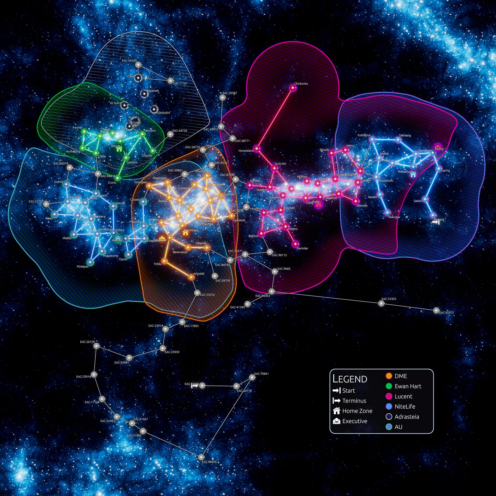

# Galaxy and Navigation

<figure class="aetheria-media-card is-wide">
  
  
An earlier in-game galaxy map render. The names and factions are dated, but the design signal is still useful: routes, territory, identity, and risk all visible at once.

</figure>

Aetheria's galaxy should feel generated, but not arbitrary. The map is a field of pressure: routes, chokepoints, faction homes, resources, security gradients, station placement, alien reach, and the bad decisions people make because the safer path costs too much.

## Generated Structure

The active game repo already includes galaxy generation, map layer data, density maps, star placement, links between stars, zone generation, wormholes, faction home zones, distance maps, and map UI. The README describes star placement along a space-filling Hilbert curve and route links created through Delaunay tessellation before being filtered for sparsity.

That machinery points toward a galaxy where topology matters. If every destination is equally reachable, there is no logistics game. Routes need friction, concentration, exposure, and local character.

## Map Layers

Map layers can define more than star density. They can describe resources, life, security, zone radius, faction interest, anomaly distribution, alien pressure, or economic intensity. This lets the galaxy become a stack of overlapping gradients rather than a bag of points.

## Routes And Chokepoints

Route structure is where strategy and action can meet. Corporate players care because routes move goods, labor, patrols, and influence. ARPG players care because routes decide what dangers they must cross and which opportunities are worth the detour.

Good routes create arguments:

- faster but hostile
- safer but expensive
- legal but surveilled
- obscure but poorly supplied
- profitable but likely to become a grave with nicer margins

## Local Space

Zones should carry local identity through bodies, orbits, stations, resources, faction presence, security level, narrative hooks, and environmental hazards. A generated sector does not need a novel's worth of bespoke prose. It needs enough material logic that a player can understand why this place produces this kind of trouble.

## Navigation As Commitment

Travel should not be frictionless menu teleportation. Even when abstracted, navigation should ask the player what they are risking: time, fuel, visibility, cargo exposure, heat buildup, enemy contact, missed opportunity, reputation, or the patience of whoever sent the contract.
