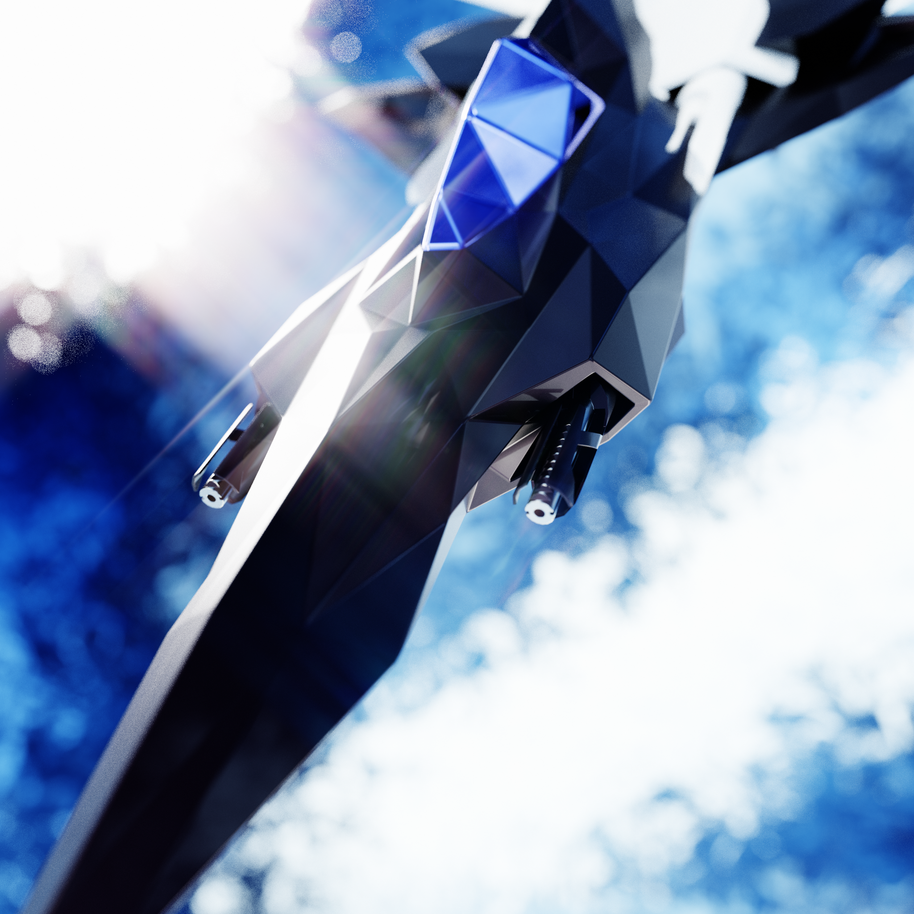

# Visual and Sensory Direction

<figure class="aetheria-media-card is-wide">
  
  
An earlier Adrasteia render with less complete material work than later versions, but stronger atmosphere: the ship half-object, half-apparition, cutting through blue glare like it expects the universe to make room.

</figure>

Aetheria should look expensive in the places that teach the player how the world works. Not merely shiny. Legible, strange, forceful, and system-revealing.

The [[Volumetric Nebulae]] prototype clips are the clearest evidence of that direction: not videos a player watches for plot, but moving studies of how Aetheria's space can behave like terrain, weather, and mood at once.

## Expressive Space

[[A Different Sort of Space]] sets the tone: Aetheria does not chase hard-SF austerity. Space can be dreamlike, luminous, dangerous, and physically expressive. The player should feel awe without losing consequence.

That means beauty should still carry information. A storm, ring, nebula, station silhouette, shield flare, thermal bloom, weapon discharge, or cloud layer should help the player understand where they are and what kind of trouble lives there.

## Shader And Atmosphere Work

The old planning links include `Aetheria Shader Implementation`, and the legacy codebase contains custom rendering work for volumetric clouds, suns, gas giants, gravity objects, zone display, weapon effects, and background rendering. This is not garnish. It is part of the game's promise: a galaxy that feels materially present even when it is stylized.

The shader document is especially clear about the gravitational terrain system: gameplay occurs on an infinite XZ-aligned surface, while dedicated orthographic cameras paint layers into floating-point render textures. Brush shaders define displacement, fog surfaces, fog patches, waves, wormholes, noise, and field effects. The Grid, minimap, volumetric sun, gas giant, and stardust particle systems are all built from that same premise.

## Combat Readability

Weapon effects should distinguish function, not just color. Lasers, lightning, projectiles, mines, shields, charge effects, radiators, aether drives, and explosions all need readable timing and threat language. The player should learn what is happening before the combat log politely confirms they are already ruined.

## Interface Tone

The interface has to bridge cockpit fantasy and spreadsheet machinery. Inventory, trade, maps, schematic displays, weapon groups, property panels, and debug tools all point toward a game where information is dense but should remain playable.

Good UI in Aetheria should feel like operational equipment: practical, layered, a little corporate, and quietly indifferent to the user's emotional needs.

## Sound And Feedback

The Wwise project and soundbank data expose attention to weapon, UI, shield, docking, undocking, wormhole, and drive feedback. Sound should reinforce the material model: heat, mass, power, malfunction, range, impact, and the difference between a clean system and one being asked to die professionally.
