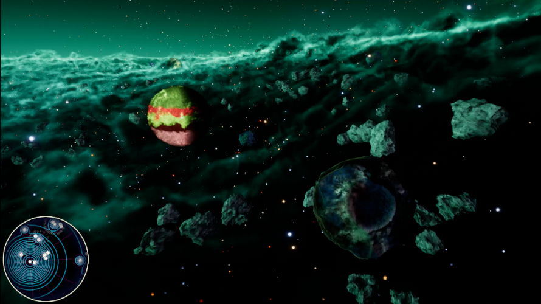

<section class="aetheria-home-intro" aria-labelledby="aetheria-home-title">
  

    
An open science-fantasy setting

    <h1 id="aetheria-home-title">Aetheria</h1>
    
A civilization with every tool it could want and no reliable way to tell itself no.

    
Aetheria follows capability outrunning collective judgment: corporate powers, engineered peoples, uploaded minds, habitats, fleets, and movements becoming indispensable to one another while disagreeing about who counts as a person and who must pay for progress.

    <nav class="aetheria-home-actions" aria-label="Start exploring Aetheria">
      <a class="aetheria-home-action is-primary" href="./Worldbuilding/">Explore the setting →</a>
      <a class="aetheria-home-action" href="./Fiction/">Read fiction</a>
    </nav>
  

  

    

      <iframe
        src="https://www.youtube-nocookie.com/embed/6hg1w2vcwDc?list=PL9lCxnhL4NfPDNsnS0ygGiJOiYMmdSFcK"
        title="Aetheria playlist starting with the Gameplay Preview Trailer"
        loading="eager"
        allow="accelerometer; autoplay; clipboard-write; encrypted-media; gyroscope; picture-in-picture; web-share"
        referrerpolicy="strict-origin-when-cross-origin"
        allowfullscreen
      ></iframe>
    

    
Gameplay preview · Cockpit action, industrial scale, and the old machinery of power.

  

</section>

<section class="aetheria-home-premise" aria-labelledby="aetheria-premise-title">
  

    
The fracture

    <h2 id="aetheria-premise-title">Old civilization arrives in altered physics</h2>
    
Humanity's first working faster-than-light experiment triggers a quarantine response and shunts an entangled civilization into Elysium. The displacement carries institutions as well as bodies: debts, maintenance systems, legal claims, labor conflicts, military habits, memory, and every compromise that was already holding somebody alive.

    
Pre-Elysium stories stay close to hard science fiction, industrial horror, corporate logistics, and noir. Post-Elysium stories add esper cognition, cultivation traditions, necrotech, impossible weather, and giant humanoid spacecraft. The physics changes. Material consequences do not.

  

  <figure class="aetheria-home-premise-media">
    
    <figcaption>The old world survives the journey. So do its invoices.</figcaption>
  </figure>
</section>

<section class="aetheria-home-paths" aria-labelledby="aetheria-paths-title">
  

    
Choose a route

    <h2 id="aetheria-paths-title">Find your way into Aetheria</h2>
    
The vault is open. Start with history, lived experience, or the machinery built to make the setting playable.

  

  <nav class="aetheria-home-path-grid" aria-label="Ways into Aetheria">
    <a class="aetheria-home-path" href="./Worldbuilding/">
      Worldbuilding
      <strong>Trace the setting</strong>
      
Move through late Sol, Elysium, factions, technologies, species, and the timeline.

    </a>
    <a class="aetheria-home-path" href="./Fiction/">
      Fiction
      <strong>Enter through a life</strong>
      
Read complete novels and shorter work where the systems become intimate.

    </a>
    <a class="aetheria-home-path" href="./Game-Design/">
      Game design
      <strong>Touch the machinery</strong>
      
Explore ships, mechanics, playable interpretations, and prototypes.

    </a>
  </nav>
</section>

## Stories The Setting Can Hold

Aetheria supports radically different modes whose causes remain visible:

- **Pre-Elysium hard science fiction and black magic:** heat, habitat engineering, cognition markets, labor control, and the dangerous research lineage that leads to the [[Worldbuilding/Pre-Elysium/Timeline/FTL Trigger|FTL Trigger]].
- **Noir and institutional mystery:** custody disputes, insurer and port gates, contradictory records, media pressure, and crimes produced by systems whose authority is divided across several respectable offices.
- **Post-Elysium mecha and cultivation drama:** [[Worldbuilding/Post-Elysium/Factions/Daedal Houses|Daedal Houses]] turn embodied piloting into ship-scale Figures, while [[Worldbuilding/Post-Elysium/Factions/Wavecrafters|Wavecrafters]] preserve operating knowledge through forms, guild discipline, and guarded lineages.
- **First contact:** species such as the [[Worldbuilding/Post-Elysium/Species/Ratfolk|Ratfolk]] arrive with their own internal plurality, accessibility needs, political disputes, and reasons to distrust any outsider asking for one representative.
- **Corporate, domestic, or workplace stories:** food, cooling, credentials, medicine, repair, transport, and shelter remain political even when nobody fires a weapon.

<section class="aetheria-book-feature" aria-labelledby="aetheria-book-feature-title">
  

    
Two complete novels · Free to read

    <h2 id="aetheria-book-feature-title">Two distant corners of one history</h2>
    
Each novel stands alone. Read either online or download the EPUB.

  

  

    <article class="aetheria-book-card">
      
Pirate workplace space opera · warm black comedy

      <h3>The Burden of Proof</h3>
      
Luce Orsino wants to rescue people so badly that he keeps building institutions capable of owning them. Four ships, repeated tactical catastrophe, and one machine person who needs the right to stop being needed.

      
<a href="./Fiction/The-Burden-of-Proof">Read online →</a><a href="./static/fiction/the-burden-of-proof.epub" download>Download EPUB</a>

    </article>
    <article class="aetheria-book-card">
      
Political mecha-academy thriller · adult/YA crossover

      <h3>The Body That Asks</h3>
      
Five cadets are selected to become the ideal family for a giant war machine. A damaged machine person makes six—and the body they form will work only if every part can still say no.

      
<a href="./Fiction/The-Body-That-Asks">Read online →</a><a href="./static/fiction/the-body-that-asks.epub" download>Download EPUB</a>

    </article>
  

</section>

## Pressures That Generate Stories

- A capability works before anyone agrees whether it should exist.
- A person is recognized in one transaction and treated as property in the next.
- Transformation expands what a body can do while narrowing who may maintain it.
- Two credible records disagree, but a port, crew, or court must act anyway.
- The kindest available choice preserves part of the institution causing the harm.
- Rescue requires temporary authority, and temporary authority develops reasons not to expire.
- A sanctuary must decide how to keep accepting people without consuming those already inside.
- Maintenance workers know the system is failing before its official dashboard admits it.

The counter-pressure is material care: food, cooling, truthful records, disability access, refuge, repair, transport, and enough shared authority to refuse the help meant to save.

Writers do not need custody of the whole universe. A story may own its cast, place, and depicted events while respecting shared setting constraints. [[Narrative Themes]] names recurring tensions; the [[Stories/How Branching Stories Are Made|writing process]] and [repository](https://github.com/GameCult/AetheriaLore) remain open for inspection and contribution.
