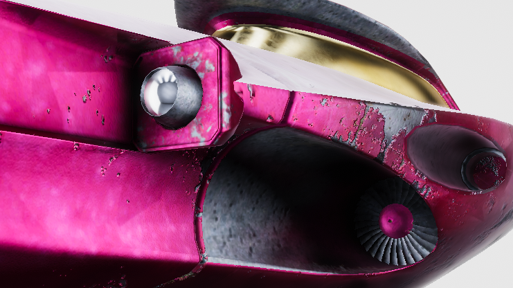

# Aetheria

*"A galaxy of megacorporate frontier myth, ship customization, and player-made history."*

Aetheria is part post-collapse corporate diaspora, part megacorporate cold war, part galaxy-scale social simulation, part action-RPG sandbox, part excuse to spend an unreasonable amount of time inventing ships, factions, and economic problems in space.

The deeper lore, design notes, and fiction live here now. This page is the fast tour for people who want the pitch before the spiral.

  <section class="aetheria-hero-panel">
    
Flagship world. Long horizon.

    
Aetheria begins with a civilizational shunt, not a clean heroic voyage. Late Sol's first real FTL gamble trips a quarantine response and dumps humanity into the sealed domain called Elysium along with the fleets, institutions, uploads, and ideological damage it was already carrying.

    
At full scale, Aetheria is a galaxy-scale MMO about multiple alien civilizations, a dozen mutually incompatible human powers, and the markets, wars, religions, and logistics nightmares they build around themselves.

    
You can inhabit that mess from the cockpit or the spreadsheet: fly as a freelancer, mercenary, trader, courier, or scavenger, or run the corporate infrastructure that moves ships, goods, and bad decisions across the map. The desk jobs create the shortages, contracts, and incentives the field players collide with in person.

    
The point is not just scale. It is watching a civilization with every tool it could possibly want remain structurally incapable of telling itself no. Competition rewards dangerous technology, reckless expansion, and the cheerful externalization of every cost that can be made into somebody else's problem. Humanity keeps driving itself into extinction. Elysium resets the branch. Everyone gets another try. Nobody gets to say they were not warned.

    
The near-term path starts smaller: focused slices of the setting that prove the mood, mechanics, and stakes before we ask the first release to carry the full weight of our galactic ambitions and associated bad habits.

    
Aetheria was quiet for a long time because the project hit the ugly part where vision had to become payroll, tooling licenses, publisher meetings, and a business model that would not quietly eat the open-source premise. The vertical slice existed. The funding path did not. Turns out reality has no respect for beautiful architecture diagrams. Rude, but consistent.

    
This site is part archive, part recovery effort, and part renewed workbench. The old code, planning documents, renders, lore, and community memory are being pulled into one canonical home so the next version can be built with clearer scope instead of heroic overextension wearing a nice hat. The longer studio note lives at <a href="https://gamecult.org/Blog/why-aetheria-went-quiet">Why Aetheria Went Quiet</a>.

  </section>
  <figure class="aetheria-media-card">
    
    
Aetheria should feel lived in, contested, and just a little impossible: less pristine new frontier, more old civilization hauled intact into a place it was never meant to inhabit.

  </figure>

  <iframe
    src="https://www.youtube-nocookie.com/embed/6hg1w2vcwDc?list=PL9lCxnhL4NfPDNsnS0ygGiJOiYMmdSFcK"
    title="Aetheria playlist starting with the Gameplay Preview Trailer"
    loading="lazy"
    allow="accelerometer; autoplay; clipboard-write; encrypted-media; gyroscope; picture-in-picture; web-share"
    referrerpolicy="strict-origin-when-cross-origin"
    allowfullscreen
  ></iframe>

Below is the short tour: the first playable cut, the conditions inside Elysium, the stranger physical rules, and the ship culture that helps everyone make their problems mobile.

  <section class="aetheria-section">
    

      

        <figure class="aetheria-media-card">
          
        </figure>
      

      <article class="aetheria-section-copy">
        <header class="aetheria-section-header">
          <h2><a href="./Game-Design/End-of-the-Line">End of the Line</a></h2>
        </header>
        

          
Aetheria: Terminus is the first sharp cut into the wider Aetheria universe: a rogue-lite ARPG about crossing a hostile galaxy to win your freedom without having to ship the entire galaxy on day one.

          
The destination is Terminus. Everything between you and it wants you dead, owned, or broken first. Procedural routes, megacorporate opposition, and the general indifference of space turn every run into a negotiation between risk, speed, and survival.

          
It is also the test chamber for the larger design: ship handling, tactical heat pressure, route choice, salvage, contracts, factional identity, and the feeling that every repair bill has a corporate ancestor somewhere smiling gently into the knife.

          
The run matters because the wider universe is waiting behind it. Terminus proves the cockpit-scale game before the project asks anyone to believe in the full persistent economy.

        

      </article>
    

  </section>
  <section class="aetheria-section">
    

      

        <figure class="aetheria-media-card">
          
        </figure>
      

      <article class="aetheria-section-copy">
        <header class="aetheria-section-header">
          <h2><a href="./Lore/Welcome-to-Elysium">Welcome to Elysium</a></h2>
        </header>
        

          
Elysium is not a clean new frontier humanity discovered with admirable courage and a reasonable plan. It is the sealed domain late Sol got thrown into when its first real FTL breakthrough touched something older, meaner, and far less interested in sharing the universe than the test brief implied.

          
The displacement was not selective. Fleets, institutions, corporate blocs, uploaded minds, labor systems, grudges, and every other unresolved compromise of solar civilization came through together because they were already materially bound together back home.

          
That is why Elysium feels less like colonization and more like a bankruptcy hearing conducted at astronomical scale. The old powers arrive with their logistics, propaganda, debt systems, succession crises, and polite explanations for why the worst part of the machine must keep running.

          
The setting's central joke, if anyone is still laughing, is that humanity gets another chance without getting a fresh character sheet.

        

      </article>
    

  </section>
  <section class="aetheria-section">
    

      

        <figure class="aetheria-media-card">
          
        </figure>
      

      <article class="aetheria-section-copy">
        <header class="aetheria-section-header">
          <h2><a href="./Game-Design/A-Different-Sort-of-Space">A Different Sort of Space</a></h2>
        </header>
        

          
Aetheria does not chase hard realism. It treats space as a place of awe, menace, and expressive scale, where gravity can become architecture and the void can feel almost inviting.

          
That choice is deliberate. The setting wants wonder first: a galaxy that looks dreamlike enough to be memorable and physical enough to feel dangerous.

          
The Grid turns gravity into terrain. Wells, waves, wormholes, storms, clouds, stardust, and luminous fields make space readable as a place of motion and pressure rather than a decorative black sheet behind the ships.

          
Beauty still has work to do. A route should tell you whether it is safe, watched, abandoned, contested, or strange before the local economy explains the same thing with fees.

        

      </article>
    

  </section>
  <section class="aetheria-section">
    

      

        <figure class="aetheria-media-card">
          
        </figure>
      

      <article class="aetheria-section-copy">
        <header class="aetheria-section-header">
          <h2><a href="./Game-Design/Ship-shape-and-Up-to-Specs">Ship-shape and Up to Specs</a></h2>
        </header>
        

          
Ships in Aetheria are tools, homes, status symbols, and bad ideas waiting to happen. Customization goes deep: components with distinct behavior, megacorporate manufacturers with their own tastes and specialties, and plenty of room to tune a vessel for violence, trade, survival, or style.

          
Build for efficiency if you must. Build for personality if you have any self-respect.

          
Under the paint, a ship is a stack of compromises: hull shape, hardpoints, reactors, radiators, thrusters, shields, sensors, cargo bays, weapon groups, quality, heat flow, and whatever bargain the manufacturer made with physics before marketing got involved.

          
The best build is not the one with the biggest numbers. It is the one that survives the kind of trouble you actually intend to start.

        

      </article>
    

  </section>

